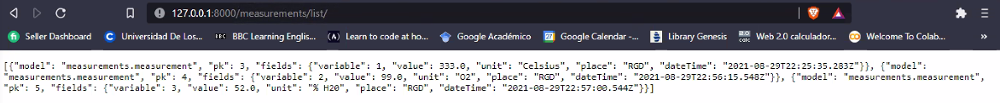
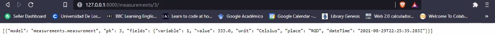
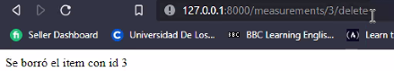
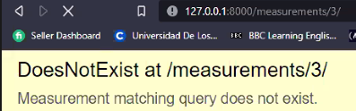
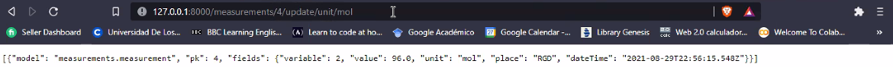
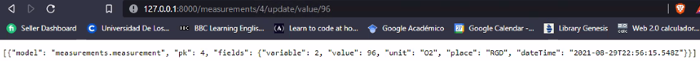

# TallerVistasDjango
Autores: Carlos Eduardo Figueredo Triana - 201813445 y Juan Manuel Rivera López - 201534131
En este taller se implementaron métodos para consultar (GET), modificar (UPDATE) y borrar (DELETE) elementos a través de los parámetros que llegan por URL. Así, se hicieron los siguientes puntos
- Consultar la lista de medidas (measurements) en formato JSON

- Consultar una medida en formato JSON dado su identificador

- Borrar una medida dado su identificador

- Cambiar una medida dado su identificador

